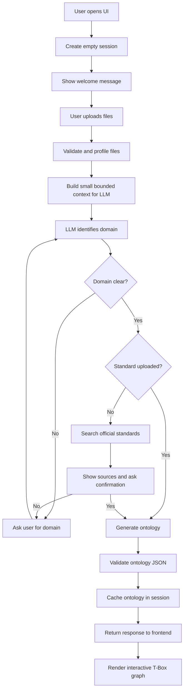

# Backend and Ontology Agent Flow — Simple Explanation

This file explains the complete application flow in simple language, starting
when the page opens and ending when the generated T-Box ontology appears on the
screen.

## The complete flow in one line

```text
Open UI → create session → upload files → validate files → profile files
→ identify domain → use uploaded standard OR research standards
→ ask confirmation when needed → generate ontology JSON
→ validate ontology → send it to React → render the T-Box graph
```

## Main files and their jobs

| File | Simple purpose |
|---|---|
| `frontend/src/components/ChatPanel.jsx` | Shows the chat and upload controls. |
| `frontend/src/App.jsx` | Controls the browser state and calls the backend. |
| `frontend/src/api.js` | Contains the actual HTTP requests to FastAPI. |
| `backend/app/main.py` | Starts FastAPI and connects all API routes. |
| `backend/app/routes.py` | Receives upload/chat requests and forwards them to the correct backend service. |
| `backend/app/ingestion_service.py` | Safely reads, checks, profiles, and temporarily stages uploaded files. |
| `backend/app/runner_service.py` | Controls the workflow: domain detection, standards confirmation, ontology generation, chat, and session state. |
| `agent/ontology_agent/agent.py` | Creates the ADK LLM agent and gives it the search tool. |
| `agent/ontology_agent/prompt.py` | Tells the LLM how to behave and what JSON format to return. |
| `agent/ontology_agent/schema.py` | Validates that the LLM's ontology has the required structure. |
| `backend/app/workflow_models.py` | Defines the response objects returned to the frontend. |
| `frontend/src/components/GraphViewNetwork.jsx` | Converts the ontology JSON into an interactive T-Box graph. |

## Visual flow



## Step 1: The backend starts

The backend entry point is [backend/app/main.py:1](backend/app/main.py#L1).

1. It loads the `.env` file at
   [backend/app/main.py:21](backend/app/main.py#L21). This makes the Gemini and
   BigQuery configuration available before the agent is imported.
2. It creates the FastAPI application at
   [backend/app/main.py:35](backend/app/main.py#L35).
3. It allows the local React UI to call the backend using CORS at
   [backend/app/main.py:38](backend/app/main.py#L38).
4. It connects all endpoints from `routes.py` at
   [backend/app/main.py:45](backend/app/main.py#L45).

## Step 2: The ADK ontology agent is created

The agent is created as `root_agent` at
[agent/ontology_agent/agent.py:10](agent/ontology_agent/agent.py#L10).

In simple terms, this code gives the LLM four things:

- **Name:** `ontology_agent`.
- **Model:** read from `ONTOLOGY_MODEL` through
  [agent/ontology_agent/config.py:14](agent/ontology_agent/config.py#L14).
- **Instructions:** the ontology rules from
  [agent/ontology_agent/prompt.py:4](agent/ontology_agent/prompt.py#L4).
- **Tool:** `google_search` at
  [agent/ontology_agent/agent.py:23](agent/ontology_agent/agent.py#L23).

The search tool is only supposed to be used when no standard was uploaded and
the backend sends `TASK: RESEARCH_STANDARDS`.

This is a **single-agent architecture**. Python controls the workflow and the
LLM performs interpretation, research, conversation, and ontology modeling.

## Step 3: The page creates a session

When the page opens:

1. React runs its initialization effect at
   [frontend/src/App.jsx:46](frontend/src/App.jsx#L46).
2. `initOntology()` at [frontend/src/api.js:4](frontend/src/api.js#L4) calls
   `POST /api/init`.
3. `init_ontology()` at
   [backend/app/routes.py:31](backend/app/routes.py#L31) calls
   `start_session()`.
4. `start_session()` at
   [backend/app/runner_service.py:234](backend/app/runner_service.py#L234)
   creates an ADK session and a `SessionWorkflow` object.

`SessionWorkflow` is defined at
[backend/app/runner_service.py:97](backend/app/runner_service.py#L97). It remembers:

- current workflow phase;
- uploaded files;
- domain;
- researched standard links;
- whether the user confirmed those links;
- latest ontology; and
- saved graph names.

The session is stored in memory at
[backend/app/runner_service.py:109](backend/app/runner_service.py#L109). Therefore,
restarting the backend clears the active chat session, but it does not remove
anything already saved in BigQuery.

The first welcome message is fixed text. Opening the page does **not** call the
LLM and does not automatically generate an ontology.

## Step 4: The user uploads files

The upload control accepts CSV, JSON, PDF, TXT, Markdown, YAML, YML, and XML at
[frontend/src/components/ChatPanel.jsx:3](frontend/src/components/ChatPanel.jsx#L3).

The call chain is:

```text
ChatPanel.submitUpload()
    → App.handleUpload()
    → api.uploadOntologyInputs()
    → POST /api/upload
    → routes.upload_ontology_inputs()
```

The important starting lines are:

- Upload button logic:
  [ChatPanel.jsx:76](frontend/src/components/ChatPanel.jsx#L76)
- App upload handler:
  [App.jsx:83](frontend/src/App.jsx#L83)
- Multipart API request:
  [api.js:20](frontend/src/api.js#L20)
- FastAPI upload endpoint:
  [routes.py:41](backend/app/routes.py#L41)

The multipart request contains the browser session ID, optional domain hint,
and selected files.

## Step 5: What “file profiling” means

The upload route calls `validate_upload_batch()` at
[backend/app/ingestion_service.py:336](backend/app/ingestion_service.py#L336).

**Profiling does not mean sending the complete file to the LLM.** Profiling
means reading the file locally and making a smaller useful description of it.

For example, when profiling a CSV, the backend calculates:

- file name and size;
- total number of rows;
- column names;
- simple data types such as string, integer, number, or boolean;
- how many values are empty in each column;
- possible ID/key columns such as `vehicle_id`; and
- a small sample of rows.

This lets the LLM understand the schema without receiving one million rows.

### Upload limits

`upload_limits()` at
[backend/app/ingestion_service.py:51](backend/app/ingestion_service.py#L51)
provides these defaults:

| Limit | Default |
|---|---:|
| Files per upload | 20 |
| Maximum size per file | 25 MB |
| Maximum combined size | 100 MB |
| Sample rows sent in a profile | 50 |
| Text extracted from a document | 120,000 characters |

### What each profiler does

| Function | Simple explanation |
|---|---|
| `_csv_profile()` at [ingestion_service.py:99](backend/app/ingestion_service.py#L99) | Reads all CSV rows to calculate counts/statistics, but keeps only a limited sample for the LLM. |
| `_json_profile()` at [ingestion_service.py:163](backend/app/ingestion_service.py#L163) | Checks valid JSON, finds fields, detects JSON Schema, counts records, and keeps bounded content. |
| `_pdf_profile()` at [ingestion_service.py:195](backend/app/ingestion_service.py#L195) | Extracts text from a readable PDF. It rejects encrypted or image-only PDFs that need OCR. |
| `_text_profile()` at [ingestion_service.py:225](backend/app/ingestion_service.py#L225) | Reads TXT, Markdown, YAML, or XML as bounded UTF-8 text. |
| `_looks_like_standard()` at [ingestion_service.py:77](backend/app/ingestion_service.py#L77) | Checks the filename and content for words such as ISO, standard, normative, compliance, or “shall”. |
| `ingest_file()` at [ingestion_service.py:270](backend/app/ingestion_service.py#L270) | Selects the correct profiler and produces one `IngestedFile` result. |

### Why the complete data is staged temporarily

`_stage_tabular_file()` at
[backend/app/ingestion_service.py:239](backend/app/ingestion_service.py#L239)
copies the complete validated CSV or record JSON into a private temporary file.

This temporary copy is needed because:

- FastAPI closes the original browser upload after the request;
- only a small profile is sent to the LLM; but
- if the user later clicks Save, BigQuery must receive the complete data.

The complete tabular file is written to BigQuery only after the user explicitly
clicks Save. Replacing an upload removes the previous temporary files through
`cleanup_ingested_files()` at
[backend/app/ingestion_service.py:263](backend/app/ingestion_service.py#L263).

## Step 6: The backend identifies the domain

After profiling, the route calls `process_uploads()` at
[backend/app/runner_service.py:361](backend/app/runner_service.py#L361).

This function is the main upload workflow controller. It:

1. saves the new file profiles in the session;
2. clears the old ontology and old researched sources;
3. changes the phase to `analyzing_uploads`; and
4. calls `_assess_domain()`.

`_assess_domain()` at
[backend/app/runner_service.py:241](backend/app/runner_service.py#L241) sends the
LLM a task similar to:

```text
TASK: ANALYZE_DOMAIN
USER DOMAIN HINT: vehicle rental
UPLOADED FILE PROFILES: table names, fields, types, counts, small samples
```

The LLM returns a short JSON result containing domain, confidence, whether it
needs clarification, a question, and a summary. The contract is
`DomainAssessment` at
[backend/app/runner_service.py:78](backend/app/runner_service.py#L78).

If the domain is unclear or confidence is below `0.65`, the backend does not
guess. It changes the phase to `awaiting_domain` and asks the user a focused
question.

### How prompt size is controlled

`_bounded_file_context()` at
[backend/app/runner_service.py:209](backend/app/runner_service.py#L209) combines
the file profiles but stops at `ONTOLOGY_PROMPT_TOTAL_LIMIT`, which defaults to
220,000 characters. This is another protection against excessive token usage.

## Step 7: Standards decision

After the domain is known, `process_uploads()` chooses one of two paths.

### Path A — the user uploaded a standard

If at least one uploaded file was classified as a standard, the backend treats
it as confirmed and directly calls `_generate_ontology()`.

The uploaded standard has priority over online information.

### Path B — the user did not upload a standard

The backend calls `_research_standards()` at
[backend/app/runner_service.py:291](backend/app/runner_service.py#L291).

In simple terms, this function:

1. sends `TASK: RESEARCH_STANDARDS` with only the confirmed domain;
2. tells the ADK agent to use Google Search;
3. collects the grounded titles and URLs returned by ADK;
4. keeps official standards organizations and public-authority domains through
   `_is_primary_source_domain()` at
   [backend/app/runner_service.py:226](backend/app/runner_service.py#L226); and
5. shows the references to the user and waits for confirmation.

The uploaded rows and sample values are never put into the web-search query.

`handle_message()` at
[backend/app/runner_service.py:386](backend/app/runner_service.py#L386) checks the
confirmation:

- `yes`, `approved`, `continue`, etc. → generate the ontology;
- `no`, `reject`, etc. → clear references and ask for the correct domain; or
- a normal question → answer conversationally without bypassing confirmation.

## Step 8: The LLM generates the ontology

`_generate_ontology()` starts at
[backend/app/runner_service.py:334](backend/app/runner_service.py#L334).

It prepares three sections:

1. **Confirmed domain** — for example, vehicle rental operations.
2. **Standards/business rules** — either uploaded standard text or confirmed
   online references.
3. **Client data/schema profiles** — columns, types, statistics, possible keys,
   and bounded samples.

It sends these sections using `TASK: GENERATE_ONTOLOGY`.

The prompt contract at
[agent/ontology_agent/prompt.py:57](agent/ontology_agent/prompt.py#L57) requires
one complete JSON object containing:

```json
{
  "entities": [
    {
      "name": "Vehicle",
      "attributes": ["vehicle_id", "registration_number"],
      "rationale": "Why Vehicle is required",
      "evidence": ["vehicles.csv"]
    }
  ],
  "relationships": [
    {
      "source": "Booking",
      "type": "RESERVES",
      "target": "Vehicle",
      "rationale": "Why this relationship exists",
      "evidence": ["bookings.vehicle_id"]
    }
  ],
  "reasoning_summary": "Short modeling explanation",
  "notes": [],
  "message": "Short message for the chat"
}
```

## Step 9: The backend validates the LLM output

The backend never sends unvalidated LLM JSON directly to the graph UI.

1. `_run_agent()` at
   [backend/app/runner_service.py:164](backend/app/runner_service.py#L164)
   executes the ADK session and collects the final response.
2. `_parse_json_response()` at
   [backend/app/runner_service.py:136](backend/app/runner_service.py#L136)
   extracts and parses the JSON object.
3. `_parse_ontology_response()` at
   [backend/app/runner_service.py:143](backend/app/runner_service.py#L143)
   validates it using the Pydantic `Ontology` model.
4. `Ontology` is defined at
   [agent/ontology_agent/schema.py:33](agent/ontology_agent/schema.py#L33).

The validated ontology is placed in `state.ontology`, and the phase changes to
`ontology_ready` at
[backend/app/runner_service.py:352](backend/app/runner_service.py#L352).

The ADK planner may use internal reasoning, but `_run_agent()` filters parts
marked as private thoughts at
[backend/app/runner_service.py:173](backend/app/runner_service.py#L173). The UI
receives conclusions, rationale, evidence, and the final ontology—not private
chain-of-thought.

## Step 10: The ontology returns to the UI

`_response()` at
[backend/app/runner_service.py:198](backend/app/runner_service.py#L198) creates a
`WorkflowResponse` containing:

- session ID;
- current phase;
- chat message;
- validated ontology;
- uploaded-file summaries; and
- confirmed/researched references.

The response structure is defined at
[backend/app/workflow_models.py:26](backend/app/workflow_models.py#L26).

React receives it through `applyWorkflowResponse()` at
[frontend/src/App.jsx:37](frontend/src/App.jsx#L37), updates the page state, and
passes the ontology to `GraphViewNetwork`.

## Step 11: The UI renders the T-Box graph

`GraphViewNetwork` begins at
[frontend/src/components/GraphViewNetwork.jsx:75](frontend/src/components/GraphViewNetwork.jsx#L75).

In simple terms, it:

- converts every ontology entity into a visual node;
- converts every ontology relationship into a directed edge;
- calculates which nodes are hubs, connectors, sources, or leaves;
- runs the force layout;
- shows the relationship type when an edge is hovered; and
- shows attributes, evidence, and connected relationships in the inspector.

The graph data is prepared at
[frontend/src/components/GraphViewNetwork.jsx:148](frontend/src/components/GraphViewNetwork.jsx#L148),
and `ForceGraph2D` renders it at
[frontend/src/components/GraphViewNetwork.jsx:431](frontend/src/components/GraphViewNetwork.jsx#L431).

This is a **T-Box graph**: nodes such as `Vehicle`, `Booking`, and `Customer`
are classes. Individual rows such as `VEH-1001` are not rendered here.

## Step 12: Follow-up chat and ontology changes

Normal chat follows this path:

```text
App.handleSend()
    → api.sendChatMessage()
    → POST /api/chat
    → routes.chat()
    → runner_service.handle_message()
```

Important starting lines:

- `handleSend()`:
  [frontend/src/App.jsx:68](frontend/src/App.jsx#L68)
- `sendChatMessage()`:
  [frontend/src/api.js:10](frontend/src/api.js#L10)
- `chat()` endpoint:
  [backend/app/routes.py:69](backend/app/routes.py#L69)
- `handle_message()`:
  [backend/app/runner_service.py:386](backend/app/runner_service.py#L386)

Before an ontology exists, chat follows the current domain/standards phase.
After an ontology exists:

- ordinary questions should preserve the ontology and return a natural answer;
- explicit add/remove/rename/change requests send the complete current ontology
  to `TASK: CHAT_OR_UPDATE_ONTOLOGY`; and
- the LLM must return the complete updated ontology, not only a small diff.

## Exactly what goes to the LLM

The LLM receives:

- domain hint;
- file names and roles;
- column/field names;
- inferred types, row counts, null counts, and possible ID columns;
- a limited sample of records;
- bounded text extracted from uploaded standards/documents;
- confirmed official reference summaries when required; and
- the current ontology during later chat/update requests.

The LLM does not receive:

- the full contents of a large CSV merely because it was uploaded;
- BigQuery credentials;
- private temporary-file paths;
- direct permission to save anything in BigQuery; or
- private thought events in the UI response.

## Important function reference

| Function | File and line | What it does in simple language |
|---|---|---|
| `initOntology()` | [api.js:4](frontend/src/api.js#L4) | Requests a new browser session. |
| `init_ontology()` | [routes.py:31](backend/app/routes.py#L31) | Receives the initialization request. |
| `start_session()` | [runner_service.py:234](backend/app/runner_service.py#L234) | Creates empty workflow state and returns the welcome message. |
| `uploadOntologyInputs()` | [api.js:20](frontend/src/api.js#L20) | Sends files and domain hint to FastAPI. |
| `upload_ontology_inputs()` | [routes.py:41](backend/app/routes.py#L41) | Connects the HTTP upload to profiling and workflow processing. |
| `validate_upload_batch()` | [ingestion_service.py:336](backend/app/ingestion_service.py#L336) | Checks upload count/size and processes every file. |
| `ingest_file()` | [ingestion_service.py:270](backend/app/ingestion_service.py#L270) | Chooses the correct file parser and creates the file profile. |
| `_stage_tabular_file()` | [ingestion_service.py:239](backend/app/ingestion_service.py#L239) | Keeps a private full copy for a later explicit BigQuery save. |
| `process_uploads()` | [runner_service.py:361](backend/app/runner_service.py#L361) | Main upload workflow decision-maker. |
| `_bounded_file_context()` | [runner_service.py:209](backend/app/runner_service.py#L209) | Prevents excessive file content from entering the prompt. |
| `_assess_domain()` | [runner_service.py:241](backend/app/runner_service.py#L241) | Asks the LLM what business domain the files represent. |
| `_research_standards()` | [runner_service.py:291](backend/app/runner_service.py#L291) | Searches official sources when no standard was uploaded. |
| `_generate_ontology()` | [runner_service.py:334](backend/app/runner_service.py#L334) | Combines domain, standards, and data profiles and asks for the ontology. |
| `_run_agent()` | [runner_service.py:164](backend/app/runner_service.py#L164) | Sends one task to ADK and collects the final model response. |
| `_parse_ontology_response()` | [runner_service.py:143](backend/app/runner_service.py#L143) | Turns the model JSON into a validated ontology object. |
| `handle_message()` | [runner_service.py:386](backend/app/runner_service.py#L386) | Routes greetings, questions, confirmations, and ontology updates. |
| `root_agent` | [agent.py:10](agent/ontology_agent/agent.py#L10) | Defines the model, instructions, planner, and search tool. |
| `Ontology` | [schema.py:33](agent/ontology_agent/schema.py#L33) | Defines the required ontology data shape. |
| `GraphViewNetwork` | [GraphViewNetwork.jsx:75](frontend/src/components/GraphViewNetwork.jsx#L75) | Draws the final interactive T-Box. |

## Files that are not part of the active flow

- `agent/ontology_agent/data.py` loads the older environment-selected local
  datasets. The current upload-first UI does not use it to build the ontology.
- `agent/ontology_agent/knowledge_graph.py` is the old handwritten ABox builder.
- The old `/api/abox` route and ABox renderer are disabled.
- The BigQuery row-level data/ABox property graph is also temporarily disabled.
  Uploaded records remain available as normal native BigQuery tables.

