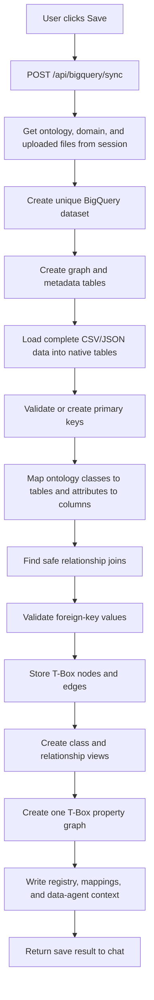

# BigQuery Save Flow — Simple Explanation

This file explains everything that happens after the user clicks **Save Dataset
& Ontology to BigQuery**.

The current design creates:

- a new isolated BigQuery dataset for every Save;
- one native table for every uploaded CSV or record-oriented JSON file;
- ontology, mapping, source, and data-agent metadata tables; and
- one T-Box property graph.

The row-level data/ABox property graph is temporarily disabled. Actual records
remain in normal BigQuery tables.

## The complete flow in one line

```text
Click Save → call FastAPI → get session ontology and uploaded files
→ create a new isolated dataset → load complete data into native tables
→ find/validate keys → map ontology to tables and columns
→ validate joins → store ontology nodes and edges
→ create T-Box views → create one T-Box property graph
→ write metadata → return dataset and graph name to chat
```

## Main files and their jobs

| File | Simple purpose |
|---|---|
| `frontend/src/App.jsx` | Handles the Save button and displays the result. |
| `frontend/src/api.js` | Sends the BigQuery save request to FastAPI. |
| `backend/app/routes.py` | Gets the current session data and starts the BigQuery save. |
| `backend/app/runner_service.py` | Returns the session's ontology, domain, and uploaded files. |
| `backend/app/bigquery_dataset_service.py` | Creates the isolated dataset, loads source data, validates keys/joins, and writes metadata. |
| `backend/app/bigquery_service.py` | Stores the T-Box nodes/edges and creates the T-Box property graph. |

## Visual flow



## Step 1: The user clicks Save

The Save button calls `handleBigQuerySync()` at
[frontend/src/App.jsx:102](frontend/src/App.jsx#L102).

That function:

1. prevents duplicate clicks while saving;
2. calls `syncBigQuery(sessionId)`;
3. waits for the backend result; and
4. prints a short confirmation containing the dataset name, table/row counts,
   and T-Box graph name.

The current success message is built at
[frontend/src/App.jsx:111](frontend/src/App.jsx#L111). It no longer shows a data
graph because that graph is disabled.

`syncBigQuery()` at [frontend/src/api.js:43](frontend/src/api.js#L43) sends:

```http
POST /api/bigquery/sync
Content-Type: application/json

{ "session_id": "current-browser-session" }
```

## Step 2: FastAPI gets the current session information

The request reaches `sync_bigquery()` at
[backend/app/routes.py:94](backend/app/routes.py#L94).

Before saving, the route gets:

- validated ontology through `get_cached_ontology()` at
  [backend/app/runner_service.py:437](backend/app/runner_service.py#L437);
- uploaded files through `get_session_files()` at
  [backend/app/runner_service.py:447](backend/app/runner_service.py#L447); and
- confirmed domain through `get_session_domain()` at
  [backend/app/runner_service.py:442](backend/app/runner_service.py#L442).

If there is no ontology, the route stops and returns an error. The BigQuery
work is run in a worker thread so it does not block FastAPI's event loop.

## Step 3: BigQuery configuration is checked

`BigQuerySettings.from_env()` at
[backend/app/bigquery_service.py:70](backend/app/bigquery_service.py#L70) reads:

| Environment variable | Simple meaning |
|---|---|
| `ONTOLOGY_BQ_ENABLED` | Whether BigQuery Save is enabled. |
| `ONTOLOGY_BQ_PROJECT` | Google Cloud project that will contain the dataset. |
| `ONTOLOGY_BQ_DATASET` | Prefix used for every generated dataset name. |
| `ONTOLOGY_BQ_LOCATION` | BigQuery location, such as `US`. |

`validate()` at
[backend/app/bigquery_service.py:92](backend/app/bigquery_service.py#L92) checks
that saving is enabled, the project exists in configuration, and the dataset
prefix is a valid BigQuery identifier.

## Step 4: A new isolated dataset name is created

The main save function is `BigQueryDatasetStore.save()` at
[backend/app/bigquery_dataset_service.py:194](backend/app/bigquery_dataset_service.py#L194).

It first selects saveable business-data files:

- CSV files containing records; and
- JSON files containing records.

It does not load standards documents, PDFs, Markdown, YAML, XML, or JSON Schema
as business tables.

`_new_dataset_id()` at
[backend/app/bigquery_dataset_service.py:186](backend/app/bigquery_dataset_service.py#L186)
creates a name such as:

```text
ontology_graph_vehicle_rental_operations_20261007_085132_8085da75
```

The parts mean:

```text
configured prefix + confirmed domain + UTC timestamp + short random ID
```

Every Save gets a new dataset. The application does not mix different upload
sessions or overwrite an older successful save.

If saving fails halfway, the cleanup at
[backend/app/bigquery_dataset_service.py:230](backend/app/bigquery_dataset_service.py#L230)
deletes only that incomplete new dataset. It never deletes an older successful
dataset.

## Step 5: The save pipeline runs in order

`_save_isolated()` at
[backend/app/bigquery_dataset_service.py:245](backend/app/bigquery_dataset_service.py#L245)
is the main BigQuery pipeline controller.

In simple terms it runs:

```text
Create base tables
→ create metadata tables
→ load source data tables
→ build mappings
→ validate relationship constraints
→ skip the disabled data/ABox graph
→ save the T-Box graph
→ write all metadata
→ return the result
```

The disabled data/ABox graph call is visibly commented at
[backend/app/bigquery_dataset_service.py:265](backend/app/bigquery_dataset_service.py#L265).

## Step 6: Base graph tables are created

`_ensure_storage()` at
[backend/app/bigquery_service.py:337](backend/app/bigquery_service.py#L337)
creates the BigQuery dataset and three tables:

| Table | Simple meaning |
|---|---|
| `graph_nodes` | Stores one row for every T-Box class, such as `Vehicle` or `Booking`. |
| `graph_edges` | Stores one row for every T-Box relationship, such as `Booking RESERVES Vehicle`. |
| `graph_versions` | Stores information about the completed graph version: ID, type, counts, source, session, and time. |

Their exact schemas are defined by `_schemas()` at
[backend/app/bigquery_service.py:517](backend/app/bigquery_service.py#L517).

These three tables contain the durable ontology graph data. The property graph
object is a graph definition built over views of these rows.

## Step 7: Metadata tables are created

`_ensure_metadata_tables()` at
[backend/app/bigquery_dataset_service.py:312](backend/app/bigquery_dataset_service.py#L312)
creates five more tables:

| Table | What it stores in simple language |
|---|---|
| `ontology_entities` | Entity names, attributes, reasons, and evidence. |
| `ontology_relationships` | Source, relationship type, target, reasons, and evidence. |
| `ontology_mappings` | How ontology words connect to real BigQuery tables, columns, and keys. |
| `source_registry` | Information about every uploaded file and which BigQuery table it became. |
| `data_agent_context` | Domain, T-Box graph name, table list, valid join instructions, and guidance for a future data agent. |

`data_agent_context.data_graph` is nullable and remains `NULL` because the
row-level data/ABox graph is disabled.

## Step 8: Complete CSV and JSON data is loaded

`_load_data_tables()` at
[backend/app/bigquery_dataset_service.py:393](backend/app/bigquery_dataset_service.py#L393)
loads each staged business file as a separate native BigQuery table.

Example:

```text
vehicles.csv  → vehicles table
customers.csv → customers table
bookings.csv  → bookings table
```

This stage uses the **complete uploaded record file**, not the small sample that
was sent to the LLM.

The function:

1. creates a safe table name from the filename;
2. handles duplicate names using `_2`, `_3`, etc.;
3. asks BigQuery to detect column types;
4. loads CSV using `load_table_from_file()`;
5. loads record JSON using `load_table_from_json()`;
6. reads the final BigQuery schema;
7. finds a safe primary key; and
8. writes a table description showing its source and mapped ontology class.

`_unique_table_names()` at
[backend/app/bigquery_dataset_service.py:377](backend/app/bigquery_dataset_service.py#L377)
handles table-name collisions.

## Step 9: Primary keys are validated

`_validated_primary_key()` at
[backend/app/bigquery_dataset_service.py:466](backend/app/bigquery_dataset_service.py#L466)
tries columns such as:

```text
vehicle_id
booking_id
customer_id
id
```

It runs a BigQuery query to verify that the candidate column:

- has no null values; and
- has a different value for every row.

If the column is safe, `_add_primary_key()` at
[backend/app/bigquery_dataset_service.py:505](backend/app/bigquery_dataset_service.py#L505)
adds `PRIMARY KEY ... NOT ENFORCED` metadata.

If no safe ID column exists, the code adds `_ontology_row_id` and fills it with
generated UUIDs. This gives every table a safe graph/mapping key without
changing the user's original file.

## Step 10: Ontology concepts are mapped to physical data

`_build_mappings()` at
[backend/app/bigquery_dataset_service.py:515](backend/app/bigquery_dataset_service.py#L515)
answers questions such as:

```text
Which table represents Vehicle?
Which column represents Vehicle.vehicle_id?
Which real columns connect Booking to Customer?
```

### Entity matching

`_entity_match()` at
[backend/app/bigquery_dataset_service.py:63](backend/app/bigquery_dataset_service.py#L63)
compares normalized table names and columns with ontology entity names and
attributes.

Example:

```text
vehicles table + vehicle_id/model/status columns → Vehicle entity
```

### Attribute matching

`_column_match()` at
[backend/app/bigquery_dataset_service.py:108](backend/app/bigquery_dataset_service.py#L108)
matches ontology attributes to physical columns after normalizing differences
such as capitals, underscores, plurals, and camel case.

### Relationship matching

`_resolve_relationship()` at
[backend/app/bigquery_dataset_service.py:641](backend/app/bigquery_dataset_service.py#L641)
looks for real columns that can safely connect the source and target tables.

For example:

```text
Ontology: Booking RESERVES Vehicle
Physical join: bookings.vehicle_id = vehicles.vehicle_id
```

It requires both entities to have tables, compatible key types, and a real
column pair. If it cannot prove a safe physical relationship, it records the
mapping as `UNRESOLVED`; it does not invent a join.

## Step 11: Foreign-key relationships are checked

`_publish_validated_constraints()` at
[backend/app/bigquery_dataset_service.py:689](backend/app/bigquery_dataset_service.py#L689)
checks whether relationship values point to real target rows.

Example:

```text
If bookings.vehicle_id = VEH-1001,
does VEH-1001 exist in vehicles.vehicle_id?
```

If any non-null value has no target, the foreign-key metadata is not published.
If every value is valid, the function adds a BigQuery
`FOREIGN KEY ... NOT ENFORCED` constraint.

`NOT ENFORCED` means BigQuery stores the relationship description but does not
automatically reject later bad data. This application validates the current
values before declaring the relationship.

## Step 12: The row-level data/ABox graph is skipped

The previous call to `_create_data_graph()` is commented out at
[backend/app/bigquery_dataset_service.py:265](backend/app/bigquery_dataset_service.py#L265).

Therefore, a new save does **not** create:

```text
data_<domain>_pg
```

The old builder remains at
[backend/app/bigquery_dataset_service.py:735](backend/app/bigquery_dataset_service.py#L735)
only so it can be restored later if record-level GQL graph traversal is needed.
It is not called by the current pipeline.

The native tables, keys, joins, mappings, and data-agent instructions remain
available. Only the second property graph is disabled.

## Step 13: The T-Box ontology is stored

`save_tbox()` at
[backend/app/bigquery_service.py:190](backend/app/bigquery_service.py#L190)
converts the validated ontology into BigQuery graph rows.

For every entity it creates a node row containing:

- entity/class name;
- type `Class`;
- attributes;
- rationale; and
- evidence.

For every relationship it creates an edge row containing:

- source entity;
- relationship type;
- target entity;
- rationale; and
- evidence.

It then calls `_save_graph()` at
[backend/app/bigquery_service.py:241](backend/app/bigquery_service.py#L241).

`_save_graph()`:

1. generates a unique graph version ID;
2. generates a graph name such as
   `ontology_vehicle_rental_operations_<timestamp>_<id>`;
3. appends nodes to `graph_nodes`;
4. appends relationships to `graph_edges`;
5. creates the T-Box property graph; and
6. writes `graph_versions` last, after the graph succeeded.

The unique graph name is created by `_new_property_graph_name()` at
[backend/app/bigquery_service.py:148](backend/app/bigquery_service.py#L148).

## Step 14: Why many `_ontology_pg_*` views are created

`_tbox_property_graph_statements()` at
[backend/app/bigquery_service.py:378](backend/app/bigquery_service.py#L378)
creates:

- one filtered view for every ontology entity; and
- one filtered view for every ontology relationship.

Examples:

```text
_ontology_pg_node_vehicle_<hash>
_ontology_pg_node_customer_<hash>
_ontology_pg_edge_booking_reserves_vehicle_<hash>
```

These are not extra graphs and they do not copy all the data. They are small
read-only definitions that filter `graph_nodes` or `graph_edges`.

They are necessary because BigQuery's graph schema screen needs separate node
and edge table definitions to display individual classes and relationships.
Without them, BigQuery could show one generic node and one self-loop.

BigQuery lists these views outside its **Graphs** folder because they are normal
dataset views used by the graph definition.

`_create_tbox_property_graph()` at
[backend/app/bigquery_service.py:360](backend/app/bigquery_service.py#L360)
runs the view definitions and the final `CREATE PROPERTY GRAPH` statement.

## Step 15: Metadata is written

`_write_metadata()` at
[backend/app/bigquery_dataset_service.py:801](backend/app/bigquery_dataset_service.py#L801)
writes:

- entities to `ontology_entities`;
- relationships to `ontology_relationships`;
- resolved and unresolved mappings to `ontology_mappings`;
- every uploaded file summary to `source_registry`; and
- domain, T-Box graph, table names, validated joins, and instructions to
  `data_agent_context`.

This is how a future data agent can connect business words to real SQL tables.
For example, it can learn that “vehicle booking” involves the `bookings` and
`vehicles` tables and which columns form the validated join.

The save operation prepares this information but does not automatically create
or publish a managed BigQuery Data Agent.

## Step 16: The result returns to chat

`DatasetSaveResult` at
[backend/app/bigquery_dataset_service.py:143](backend/app/bigquery_dataset_service.py#L143)
contains:

- generated dataset name;
- data-table names;
- total saved row count;
- T-Box graph details;
- resolved relationship count; and
- unresolved relationship count.

The old `data_graph_name` and preview fields remain empty for API compatibility.

The FastAPI route returns the result at
[backend/app/routes.py:124](backend/app/routes.py#L124). React formats the clean
chat message at [frontend/src/App.jsx:111](frontend/src/App.jsx#L111).

## What one successful dataset contains

If the upload contains `S` business tables, the ontology contains `E` entities,
and it contains `R` relationships, the new dataset contains:

| Object type | Count | Meaning |
|---|---:|---|
| Native business tables | `S` | One table per CSV or record JSON file. |
| Graph storage tables | 3 | `graph_versions`, `graph_nodes`, `graph_edges`. |
| Metadata tables | 5 | Entities, relationships, mappings, source registry, and agent context. |
| Entity views | `E` | One T-Box node view per ontology entity. |
| Relationship views | `R` | One T-Box edge view per ontology relationship. |
| Property graphs | 1 | The uniquely named T-Box ontology graph. |

So the dataset normally contains `S + 8` native tables, `E + R` supporting
views, and one property graph.

## Simple example

Assume the user uploads:

```text
vehicles.csv
customers.csv
bookings.csv
```

The generated ontology contains:

```text
Customer ──MAKES──> Booking ──RESERVES──> Vehicle
```

The new BigQuery dataset will contain:

```text
Native data:
  vehicles
  customers
  bookings

Ontology storage:
  graph_nodes
  graph_edges
  graph_versions

Metadata:
  ontology_entities
  ontology_relationships
  ontology_mappings
  source_registry
  data_agent_context

Views:
  one for Customer
  one for Booking
  one for Vehicle
  one for MAKES
  one for RESERVES

Graph:
  ontology_vehicle_rental_operations_<timestamp>_<id>
```

There is no `data_vehicle_rental_operations_pg` in newly saved datasets.

## Important function reference

| Function | File and line | What it does in simple language |
|---|---|---|
| `handleBigQuerySync()` | [App.jsx:102](frontend/src/App.jsx#L102) | Starts saving and prints the result in chat. |
| `syncBigQuery()` | [api.js:43](frontend/src/api.js#L43) | Calls the BigQuery Save endpoint. |
| `sync_bigquery()` | [routes.py:94](backend/app/routes.py#L94) | Gets session information and starts persistence. |
| `BigQuerySettings.from_env()` | [bigquery_service.py:70](backend/app/bigquery_service.py#L70) | Reads the BigQuery configuration. |
| `BigQueryDatasetStore.save()` | [bigquery_dataset_service.py:194](backend/app/bigquery_dataset_service.py#L194) | Creates a new isolated save and handles failed-save cleanup. |
| `_new_dataset_id()` | [bigquery_dataset_service.py:186](backend/app/bigquery_dataset_service.py#L186) | Generates a collision-safe dataset name. |
| `_save_isolated()` | [bigquery_dataset_service.py:245](backend/app/bigquery_dataset_service.py#L245) | Runs the full ordered BigQuery pipeline. |
| `_ensure_storage()` | [bigquery_service.py:337](backend/app/bigquery_service.py#L337) | Creates the dataset and three graph storage tables. |
| `_ensure_metadata_tables()` | [bigquery_dataset_service.py:312](backend/app/bigquery_dataset_service.py#L312) | Creates the five metadata tables. |
| `_load_data_tables()` | [bigquery_dataset_service.py:393](backend/app/bigquery_dataset_service.py#L393) | Loads complete CSV/JSON records into native tables. |
| `_validated_primary_key()` | [bigquery_dataset_service.py:466](backend/app/bigquery_dataset_service.py#L466) | Verifies a unique ID or generates `_ontology_row_id`. |
| `_build_mappings()` | [bigquery_dataset_service.py:515](backend/app/bigquery_dataset_service.py#L515) | Connects ontology concepts to real tables and columns. |
| `_resolve_relationship()` | [bigquery_dataset_service.py:641](backend/app/bigquery_dataset_service.py#L641) | Finds a safe physical join for one ontology relationship. |
| `_publish_validated_constraints()` | [bigquery_dataset_service.py:689](backend/app/bigquery_dataset_service.py#L689) | Checks orphan values before adding FK metadata. |
| `save_tbox()` | [bigquery_service.py:190](backend/app/bigquery_service.py#L190) | Converts ontology entities/relationships into node/edge rows. |
| `_save_graph()` | [bigquery_service.py:241](backend/app/bigquery_service.py#L241) | Writes graph rows, creates the T-Box graph, and records its version. |
| `_tbox_property_graph_statements()` | [bigquery_service.py:378](backend/app/bigquery_service.py#L378) | Builds the entity/relationship views and graph SQL. |
| `_write_metadata()` | [bigquery_dataset_service.py:801](backend/app/bigquery_dataset_service.py#L801) | Writes ontology, source, mapping, join, and agent metadata. |
| `_create_data_graph()` | [bigquery_dataset_service.py:735](backend/app/bigquery_dataset_service.py#L735) | Disabled builder retained only for possible future use. |

## Important behavior to remember

- Existing older datasets that already contain two property graphs are not
  changed or deleted.
- Only newly saved datasets follow the current one-T-Box-graph design.
- Every click creates a new isolated dataset.
- Native client data is written only after the user explicitly clicks Save.
- Standards documents are recorded in `source_registry` but are not loaded as
  business-data tables.
- Unproven relationships are stored as unresolved mappings, not invented joins.
- The T-Box graph shows classes and relationship types; it does not create
  individual record nodes.

